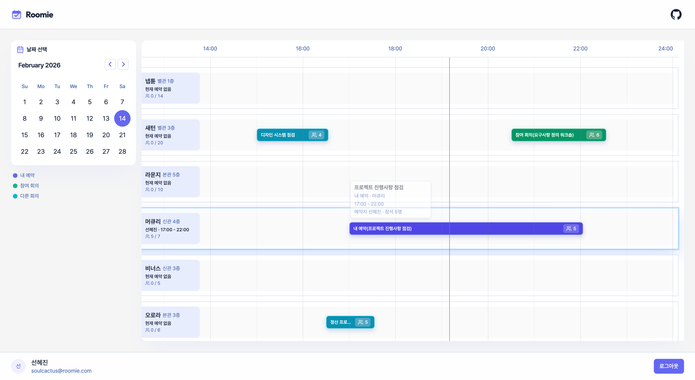
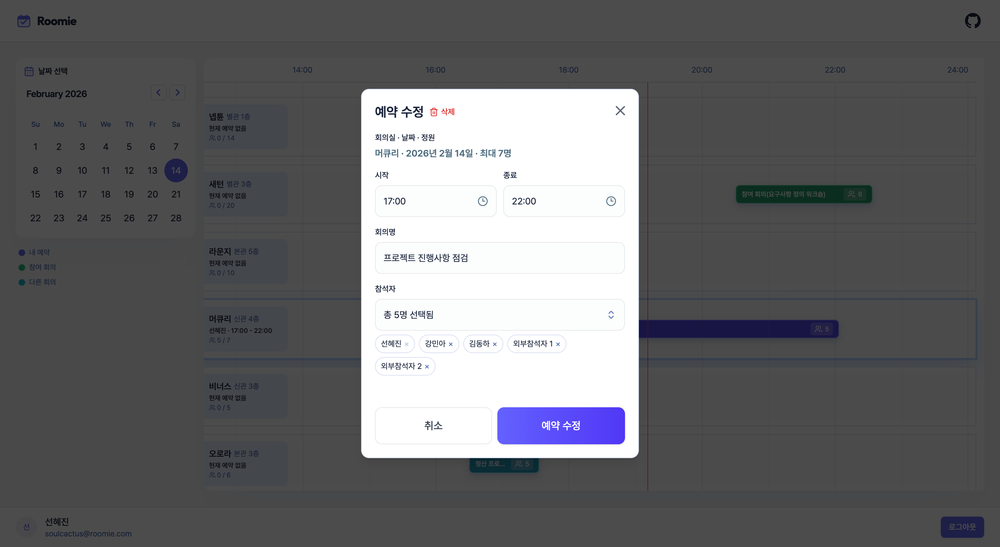
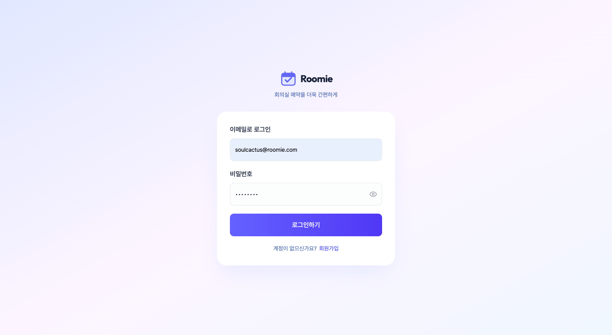
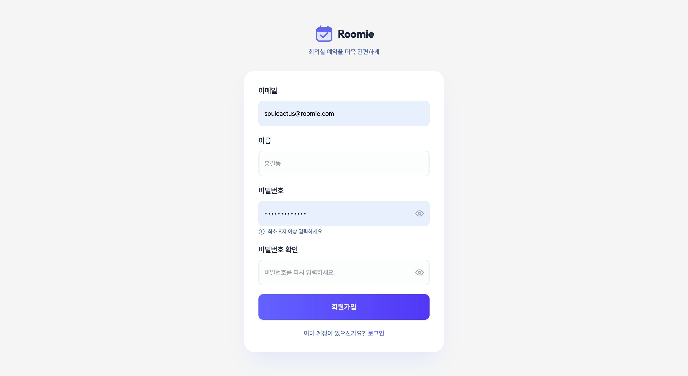

# Roomie

회의실 예약 도메인을 중심으로 **NestJS + Next.js 기반의 풀스택 SaaS 아키텍처를 설계·구현한 프로젝트**입니다.  
프론트엔드 중심 경력을 기반으로, 인증·API 설계·DB 모델링·배포 환경까지 직접 구성하며 서비스 전반을 통합적으로 설계하고 운영하는 역량을 확장하는 것을 목표로 했습니다.

## 🔗 데모

- Frontend: [서비스 바로가기](https://roomie-frontend-kohl.vercel.app)
- Swagger: [API 문서](https://roomie-tkm1.onrender.com/docs) (데모 목적 공개)

## 🖼️ 스크린샷






## 🎨 디자인 리소스

- 로그인 흐름 디자인(Figma Make 활용): [Roomie Web](https://www.figma.com/design/VXmTw7hHYIqJA9doiBBPyC/Roomie-Web?node-id=0-1&m=dev)
- 브랜드 가이드/로고(Figma Make 활용): [Brand Guidelines](https://www.figma.com/design/wtF27olB9HH9o2ahwYgnpT/Brand-Guidelines?node-id=5-753&m=dev)

## 🧱 기술 스택

### Frontend

- **Next.js (App Router)**: 서버 컴포넌트 기반 라우팅 및 BFF(Route Handler) 구성
- **React + TypeScript**: 타입 안정성을 기반으로 한 컴포넌트 설계
- **TanStack Query**: 서버 상태 캐싱/재검증 중심 데이터 관리
- **Tailwind CSS**: 유틸리티 퍼스트 스타일링으로 일관된 디자인 시스템 구성
- **MSW**: 백엔드 의존성 없이 기능 단위 개발을 위한 API 모킹 환경 구성

### Backend

- **NestJS (Fastify Adapter)**: 계층형 구조 + DI 기반 아키텍처, Fastify 어댑터 적용
- **Prisma**: 스키마 중심 ORM, 타입 안전한 DB 접근
- **PostgreSQL**: 관계형 데이터 모델링 기반 예약 도메인 구현
- **JWT**: Access/Refresh 토큰 기반 인증 구조

### Infrastructure & Tooling

- **pnpm workspace + Turbo**: 모노레포 환경에서 의존성/빌드 파이프라인 관리
- **Swagger (`@nestjs/swagger`)**: API 스펙 문서화 및 테스트 가능 환경 제공

## 🤔 기술 선택 이유

- **Fastify (NestJS Adapter)**  
  Express 기본 어댑터 대신 Fastify를 적용해 HTTP 레이어의 경량화를 지향했습니다.  
  단순 성능 수치보다, 구조적으로 확장 가능한 어댑터 기반 설계를 경험하는 데 목적이 있으며, 추후 로깅·플러그인·미들웨어 확장에 유연한 구조를 고려했습니다.

- **Prisma (Schema-driven ORM)**  
  스키마 중심 설계를 통해 데이터 모델을 단일 진실 원천(Single Source of Truth)으로 관리했습니다.  
  타입 안전한 쿼리 생성과 마이그레이션 관리로, API–DB 간 불일치를 최소화하고 도메인 모델 변경 시 영향 범위를 예측 가능하게 유지했습니다.

- **TanStack Query (Server State Management)**  
  서버 상태를 클라이언트 상태와 분리해 관리하기 위해 도입했습니다.  
  캐싱·재검증(refetch)·에러 상태를 선언적으로 다루며, 비동기 흐름을 UI 로직과 분리해 유지보수성을 높였습니다.

- **Monorepo (pnpm workspace + Turbo)**  
  프론트엔드·백엔드·공용 타입 패키지를 하나의 리포지토리에서 관리해 변경 추적과 의존성 흐름을 단순화했습니다.  
  Turbo를 통해 빌드 캐싱과 파이프라인을 구성해, 전체 시스템 관점에서의 개발 생산성을 확보했습니다.

## ✨ 주요 기능

- **인증 및 세션 관리**
  - 회원가입 / 로그인 / 로그아웃 / 토큰 재발급 흐름 구현
  - Access/Refresh 기반 이중 토큰 구조 설계
  - JWT Guard + Role Guard를 통한 인증/인가 분리
- **하이브리드 쿠키 인증 전략**
  - **Access Token**: HttpOnly가 아닌 Cookie로 저장하고 짧은 만료 시간을 적용해 요청 단위 인증에 사용
  - **Refresh Token**: HttpOnly Cookie로 저장하고, 운영(production) 환경에서는 `Secure` 옵션을 적용하며 개발 환경에서는 `secure: false`로 분기(`NODE_ENV` 기준)해 사용. JS 접근을 차단하고 재발급 전용 토큰으로 관리
  - 토큰 만료/위조/누락 시 서버에서 401 응답 후 재발급 또는 세션 종료 흐름으로 명확히 분기

- **BFF (Backend for Frontend) 프록시 레이어**
  - Next.js Route Handler 기반 API 프록시 구성
  - 브라우저는 same-origin(`/api/v1/*`)만 호출하도록 설계해 쿠키/헤더 정책을 서버 레이어로 수렴

- **회의실/예약 도메인 구현**
  - 회의실 및 예약 CRUD
  - 시간대 겹침 검증 로직을 통한 중복 예약 방지
  - 내부/외부 참석자 분리 모델링

- **감사 로그(Audit Log) 적재**
  - 주요 행위(예약 생성/수정/취소 등)를 기록해 도메인 이벤트 추적 가능 구조로 설계

## 📈 성과 및 품질 지표

- **타입 안정성 유지**
  - 프론트엔드/백엔드 모두 `tsc --noEmit` 기준 타입 에러 0 상태를 유지
  - 공용 타입(예: DTO, 응답 포맷)을 기준으로 API–UI 간 계약 불일치 최소화
- **인증 실패 시나리오 명확화**
  - 만료/위조/누락 토큰에 대해 401 응답으로 일관되게 처리
  - Refresh 실패 시 세션 종료 후 로그인 화면으로 복귀하는 흐름 정의
- **예약 중복 방지 로직**
  - 클라이언트에서 1차 시간 겹침 체크 수행
  - 서버/DB에서 동일 시간대·회의실 충돌을 최종 차단(Exclusion 제약 + 409 응답)
- **운영 안정성 점검**
  - Health-check 엔드포인트를 통해 서버 기동 상태 확인
  - 배포 환경에서 keep-alive 및 기본 응답 상태를 주기적으로 점검
- **기본 테스트 루틴 유지**
  - `test`, `test:cov` 스크립트를 통해 주요 로직에 대한 회귀 테스트 실행
  - 로컬/배포 전 검증 단계에서 타입 체크와 테스트를 수동 실행하는 운영 방식 유지

## 🎯 프론트엔드 관점 설계 포인트

- **Server State와 UI State의 명확한 분리**
  - 서버 데이터는 TanStack Query로 관리하고, 모달 열림/폼 draft 같은 UI 상태는 로컬 상태로 분리
  - 상태 책임을 분리해 화면 로직 복잡도를 낮추고 유지보수성을 높임
- **React Query 캐싱 및 재검증 전략**
  - `refetchOnWindowFocus`, `refetchOnReconnect`, `refetchInterval(30초)` 조합으로 데이터 신선도 유지
  - 낙관적 업데이트 대신 서버 응답을 기준으로 동기화해 데이터 일관성을 우선
- **BFF 기반 API 추상화**
  - 클라이언트는 /api/v1/\* 경로만 호출하고, Next Route Handler가 백엔드로 프록시
  - 쿠키 전달/인증 관련 처리를 BFF 경로로 모아 클라이언트 네트워크 로직을 단순화
- **에러 UX 처리**
  - 요청 실패 시 toast 알림으로 즉시 피드백 제공
  - 화면 상태(loading / empty / error / success)를 분리해 상황별 UI를 명확히 표시

## 🧭 설계 결정과 트레이드오프

### BFF 도입 이유

- **문제 인식**: Vercel(프론트)과 Render(백엔드)의 도메인이 분리되어 있어, HttpOnly 쿠키 기반 인증 흐름이 브라우저 정책(SameSite, Secure, CORS)에 강하게 의존하는 구조였습니다.
- **설계 결정**: Next.js Route Handler를 BFF 레이어로 두고, 브라우저는 동일 오리진(`/api/v1/*`)만 호출하도록 구조를 재설계했습니다.
- **결과**:
  - 인증 헤더·쿠키 전달 로직을 클라이언트에서 제거하고 서버 레이어로 수렴
  - 인증 실패/재발급/로그아웃 흐름은 BFF 경유 요청과 클라이언트(httpClient) 재발급 로직이 함께 처리
  - 프론트엔드 네트워크 로직 복잡도 감소

### 단순 CORS 해결 이상의 의미

- 브라우저 정책에 직접 노출되는 영역을 최소화하고, 인증 정책을 서버에서 일관되게 관리
- 인증/갱신 로직을 전역 상태가 아닌 API 레이어로 한정해 책임 범위를 명확히 분리
- 향후 필요 시 응답 포맷 정규화/로깅/레이트 리밋 레이어로 확장 가능한 구조 확보

### 쿠키 인증 구조의 이점과 한계

- **설계 의도**
  - Access Token은 짧은 수명으로 발급해 요청 단위 인증에 사용
  - Refresh Token은 HttpOnly Cookie로 보호해 장기 세션을 관리
  - 인증 검증은 서버(JWT Guard)에서 일관되게 수행
- **보안 고려**
  - Refresh Token은 JS 접근을 차단해 XSS 노출 범위를 제한
  - SameSite / Secure / Path 옵션을 환경별로 명시해 예측 가능한 쿠키 동작 보장
- **트레이드오프**
  - Access Token을 JS 접근 가능 Cookie로 사용하는 구조는 XSS 위험을 완전히 제거하지 못함
  - 보안 강화를 위해 HttpOnly Access + 서버 세션 전략으로 전환 가능하다는 점을 인지
- **학습 포인트**
  - 배포 환경(Vercel ↔ Render)에서 CORS, credentials, 쿠키 속성 조합이 실제 인증 안정성에 큰 영향을 미친다는 점을 경험적으로 확인

## 🗂️ 프로젝트 구조

```text
apps/
  frontend/   # Next.js
  backend/    # NestJS + Prisma
packages/
  shared/     # 공용 패키지(현재 최소 구성)
docker/
  frontend/
  backend/
```

## 🔐 환경 변수

루트 `.env.example`을 기준으로 아래 파일을 구성합니다.

- Backend: `apps/backend/.env`
- Frontend: `apps/frontend/.env.local`

### Backend 변수 (전체)

- `DATABASE_URL`
- `JWT_SECRET`
- `JWT_ACCESS_EXPIRES_IN`
- `JWT_REFRESH_EXPIRES_IN`
- `COOKIE_SECRET`
- `NODE_ENV`
- `BACKEND_PORT`
- `FRONTEND_URL`
- `ENABLE_SWAGGER_UI`
- `SEED_ADMIN_EMAIL`
- `SEED_ADMIN_NAME`
- `SEED_ADMIN_PASSWORD`
- `SEED_USER_PASSWORD`
- `SEED_BOOKING_YEAR`

### Frontend 변수

- `NEXT_PUBLIC_API_URL`
- `NEXT_PUBLIC_ENABLE_MSW`

## 🌱 Seed 데이터 안내

`seed`는 개발/데모용 초기 데이터를 DB에 주입하는 스크립트입니다.  
이 프로젝트에서는 회의실, 사용자, 예약 샘플 데이터를 생성해 타임라인 UI를 바로 확인할 수 있게 합니다.

## 🚀 로컬 실행

```bash
pnpm install
docker compose up -d postgres
pnpm --filter backend exec prisma db push
pnpm --filter backend run prisma:seed
pnpm dev
```

- Frontend: `http://localhost:3000`
- Backend: `http://localhost:3001`

초기화 후 재시드:

```bash
pnpm --filter backend exec prisma db push --force-reset
pnpm --filter backend run prisma:seed
```

## 🐳 Docker 실행

```bash
docker compose up --build -d
docker compose exec backend pnpm --filter backend run prisma:seed
```

- Frontend: `http://localhost:3000`
- Backend: `http://localhost:3001`
- PostgreSQL: `localhost:5432`

## 📚 API 문서 (Swagger)

- `ENABLE_SWAGGER_UI=true`일 때 활성화
- 로컬 주소: `http://localhost:3001/docs`

## ✅ 테스트 / 검증

```bash
pnpm --filter backend test
pnpm --filter backend test:cov
pnpm --filter backend exec tsc --noEmit
pnpm --filter frontend exec tsc --noEmit
```

## ☁️ 배포

- Frontend: Vercel
- Backend + DB: Render
